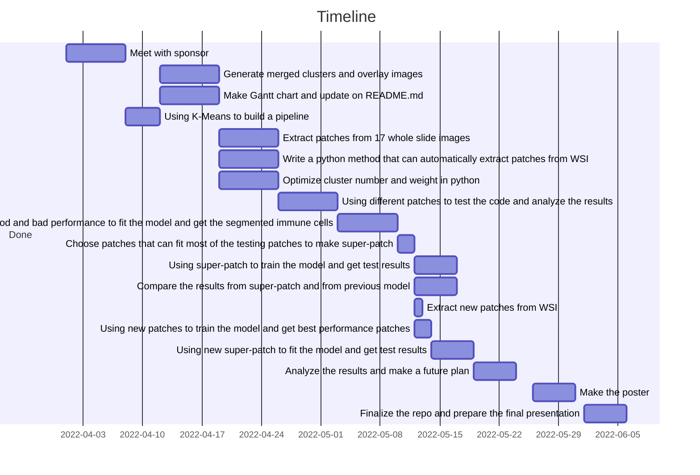

[](https://opensource.org/licenses/MIT)


# Digital_segmentation_BRCA_547_Capstone

## Project Objective
The project is intended to segment immune cells on the stained images. And we have already bulit an automaic pipeline that 
can extarct every patches from the Whole slide Image(WSI) of cancer tissue and using K-means clustering algorithm to get the 
overlayed immune cells.

## Use Cases
Generate clusters from an individual patch determine every component separately.</br>
Overlay a single, multiple or all clusters at once on a patch depending upon the analysis that clinician needs to perform.</br>
Automated process of an input WSI and multiple output overlayed patches.</br>
Automating components of analysis which are constant and enabling enough interventional capability for the user.</br>
Ability to classify different components within a particular subcluster of interest (if any exists)</br>

## Methodology


## Installation
In order to use the code, you can create a virtual environment on a Windows system as follows:
Note: If you are using Unix or a conda environment, the steps might change accordingly.

**Step 1:** Clone the repository to your computer.

**Step 2:** Open the command prompt/shell and type `pip install virtualenv`

**Step 3:** In the command prompt/shell type `virtualenv environment_cluster`

**Step 4:** Create the virtual environment by typing `virtualenv environment_cluster`

**Step 5:** Activate the virtual environment by typing `.\environment_cluster\Scripts\activate`

**Step 6:** Enter the path to the repository on terminal `cd ./././Digital_segmentation_BRCA_547_Capstone`

**Step 7:** Install dependencies by typing `pip install -r requirements.txt`

## Example


1. Extracted H&E-stained patch.

2. Digitally clustered patch.

3. Overlay of the digitally clustered patch.

4. Digital map of the segmented immune cells

5. Overlay of the segmented patch.

## Repo Structure
```
Digital_segmentation_BRCA_547_Capstone
-----
Digital_segmentation_BRCA_547_Capstone/
|-doc/
| |-example/paper/
| | |-_init_.py
| |-Use_cases_and_design_components.docx
| |-Use_cases_and_design_components.pdf
| |-ChemE_547_Final_Poster.pdf
| |-Pitch.docx
|-tests/
| |-_init_.py  
|-cluster.py
|-requirements.txt
|-test_cluster.py
LICENSE
Picture1.png
Picture2.png
README.md
```
## Ongoing and Future Work
ONGOING: In order to improve the accuracy and performance of the model even further, we are currently applying textural post 
processing techniques.
 
FUTURE WORK: Implement supervised learning for further segmentation of the immune map.


## Timeline

## Group Members: Zilun Cai, Yanyao Han, Ruofan Liu, Vidit Shah.
